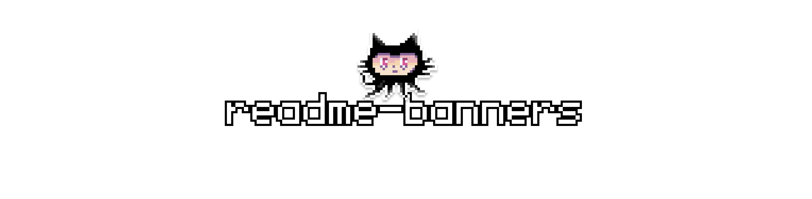

# 

> [!NOTE]
> This repository was created primarily to streamline the process of adding banners to my README files. However, if you come across this repo, feel free to use these images for your own projects as well!

### Overview

This repository is dedicated to storing banners for various platforms and courses. These banners are used at the beginning of each README file in my project repositories to provide a consistent and visually appealing introduction to the content.

## 🚀 Purpose

The purpose of this repository is to centralize and manage all banners that I use across different projects, making it easier to maintain and update them. By keeping these banners in one place, I can ensure consistency and save time when setting up new project READMEs.

## 🖼️ Available Banners

### freeCodeCamp
A banner for the freeCodeCamp platform, used for projects related to freeCodeCamp's courses.


<hr>

### Exercism
A banner for the Exercism platform, used for repositories containing solutions to Exercism exercises.


<hr>

### The Odin Project
A banner for The Odin Project, used for projects related to The Odin Project’s curriculum.


## ⚙️ How to Use

To use a banner in your README, simply copy the URL of the desired banner image from this repository and insert it into your README file as needed. For example:

```markdown

```

## ⭐️ Support
 Feel free to open issues for banners suggestions. If you find these banners helpful, consider giving this repository a star ⭐️ to show your support and help others discover it!